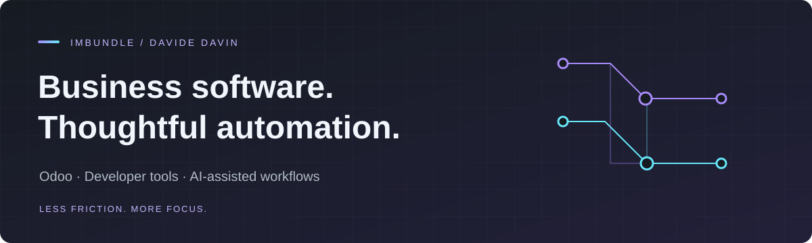

### Practical systems. Clear interfaces.

I'm **Davide Davin**, working at **Codestorm S.r.l.** My focus is Odoo, developer tooling, and AI-assisted workflows: connecting business software with tools that make everyday work easier.

## What I work on

- **Business systems** — Odoo workflows, integrations, and operational tooling.
- **Developer experience** — clearer interfaces for repositories and local workspaces.
- **Applied AI** — automation that supports real work, with verification in the loop.

## Selected projects

| Project | Focus |
| :--- | :--- |
| [**Mission Control · Projects**](https://github.com/imbundle/mc-project-plugin) | Local Git and GitHub workspace monitoring inside Mission Control. |
| [**Mission Control · Odoo**](https://github.com/imbundle/mc-odoo-tui-plugin) | An external plugin connecting the Mission Control workspace with Odoo tooling. |

## Toolkit

**Python** · **TypeScript** · **Odoo** · **Git & GitHub**

---

Build for the workflow. Keep the architecture honest.
